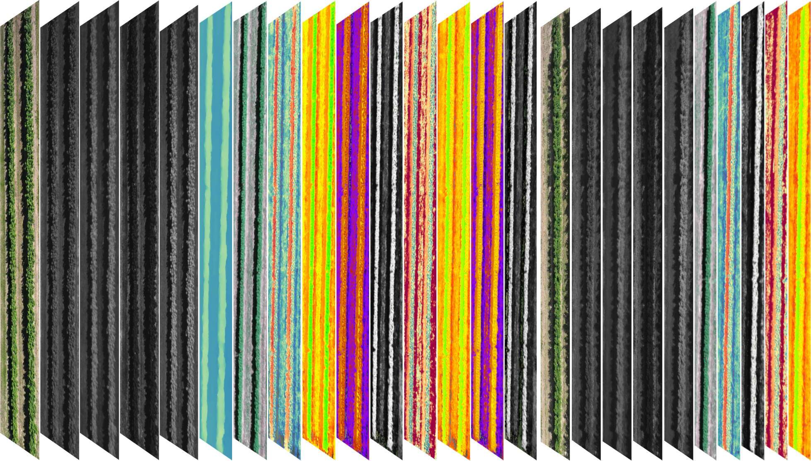
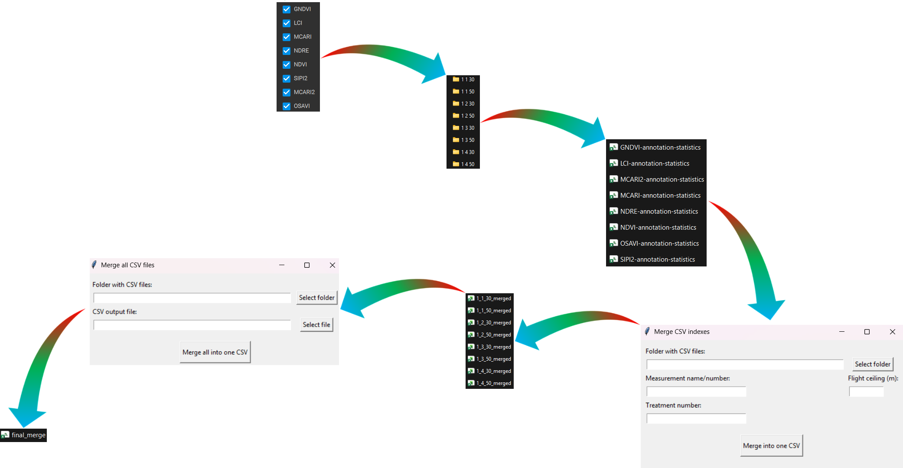
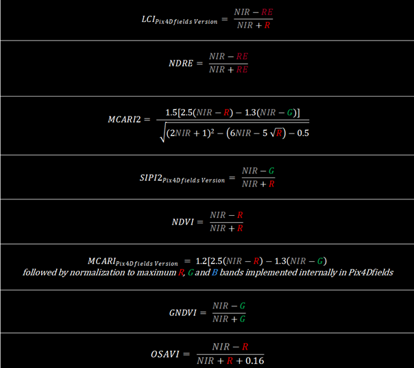

### `Data pre-processing and analysis of the results obtained in Pix4Dfields`
This repository contains mutlispectral data, and also all preprocessing and evaluation code used in the study 
“Impact of Biostimulants Foliar Applications on Primocane Raspberries Assessed Using UAV-Based Multispectral Imaging”.

The "codes" folder contains all the scripts and algorithms used to analyze and pre-process the results obtained in Pix4Dfields. The "data" folder contains the results obtained in Pix4Dfields, and the "results_csv" and "results_graphs" folders contain the final results of their analysis.

## Citation
If you use this repository, please cite:
Will be added after publication

Multispectral imaging generates large volumes of data that necessitate advanced analytical approaches. Pix4Dfields software enables the calculation of vegetation indices for user-defined regions, together with associated standard deviation values, which constitute a key input for subsequent analyses. Although this transformation reduces raw imagery to more interpretable quantitative indicators, it results in a considerable number of outputs, the correct interpretation of which becomes particularly important in long-term experimental studies.

In the analysis of vegetation indices obtained from Pix4Dfields across multiple time points, an initial data preprocessing step may be applied, including, where appropriate, exploratory data analysis (EDA). This approach is particularly valuable when datasets are generated using different acquisition or processing settings, such as varying ground sampling distances (GSD) or annotation methods, as it facilitates the identification of the most consistent outputs for further interpretation. Nevertheless, the application of this procedure is not obligatory in all analytical contexts. 

  

The diagram presented above outlines the full workflow of preliminary data processing. The procedure starts with exporting panel-based results for multiple layers corresponding to vegetation indices generated in Pix4Dfields, along with the associated directory structure created by the software. As a result, each measurement yields a set of outputs comprising vegetation index values calculated for all annotated areas within the study site, stored as individual .csv files. 

To prepare the results for final visualization, presenting relative differences as percentages, a series of calculations is performed. The included scripts allow for the presentation of both individual differences for each measurement series and totals regardless of treatment. All source codes are included in the codes section.

The analysed results represent vegetation index values, while the mathematical definitions of the applied indices are described below.

